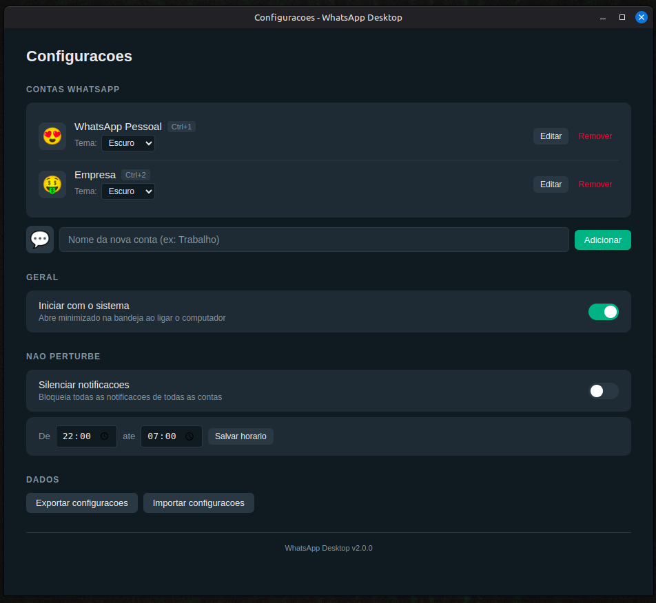
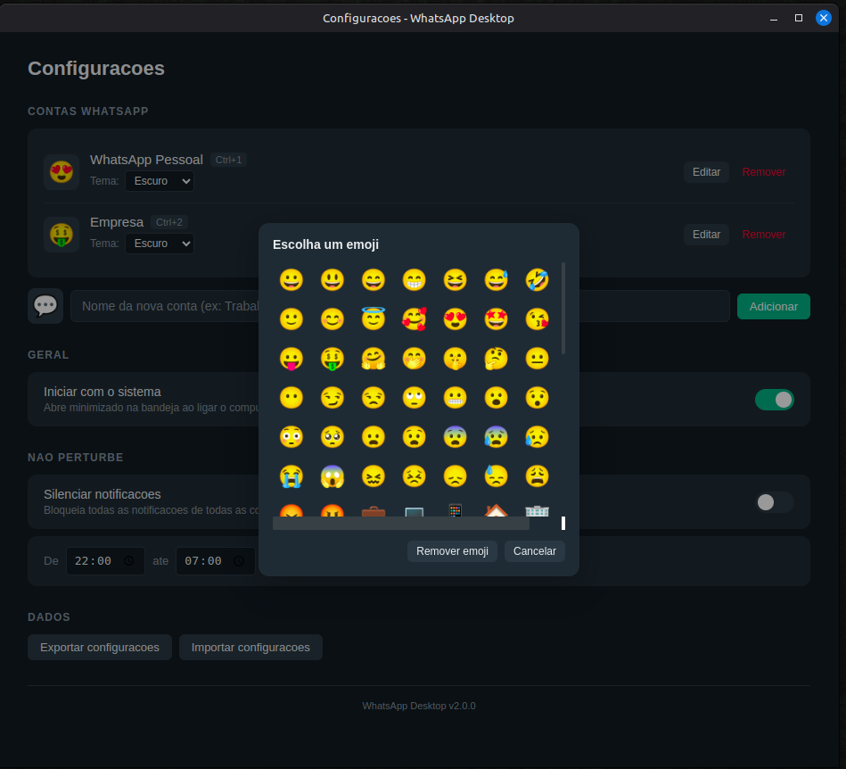
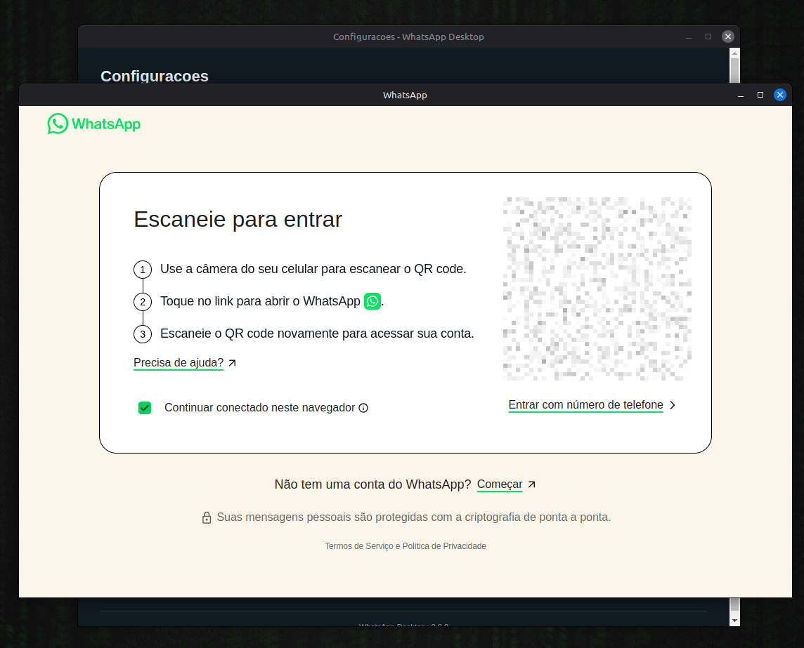
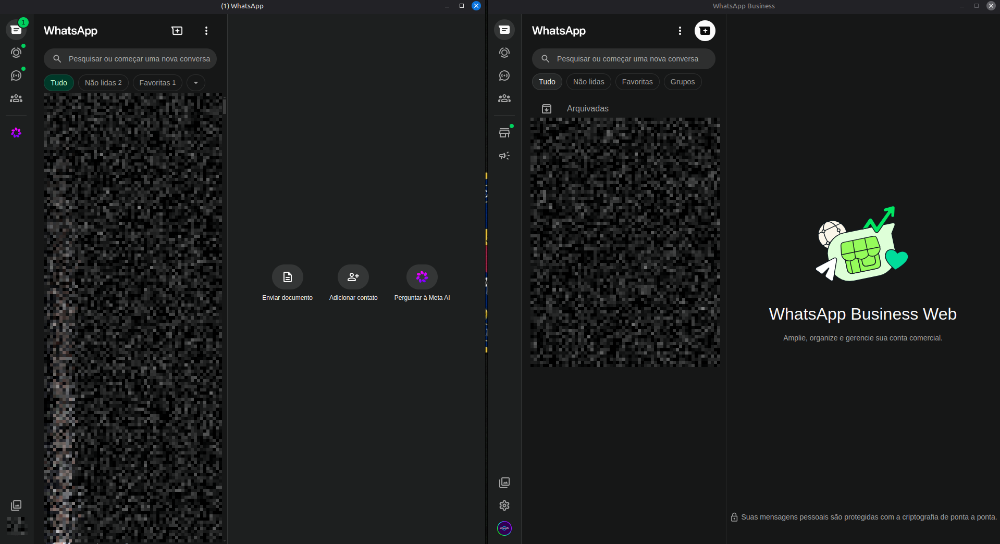

# WhatsApp Desktop for Linux (unofficial)

WhatsApp Desktop for Linux (unofficial) – maintained by Cleyton Alves ([cleyton1986/WhatsAppDesktop](https://github.com/cleyton1986/WhatsAppDesktop)).

Um wrapper para [WhatsApp Web](https://web.whatsapp.com/) desenvolvido com Electron, permitindo usar o WhatsApp em ambiente desktop no Linux.

## Screenshots

| Configuracoes | Emoji por conta |
|---|---|
|  |  |

| Login (QR Code) | Multi-conta |
|---|---|
|  |  |

## Funcionalidades

### Multi-conta
- Conecte multiplas contas WhatsApp simultaneamente (ex: Pessoal + Empresa)
- Cada conta abre em janela separada com sessao isolada
- Alterne entre contas via atalhos de teclado `Ctrl+1`, `Ctrl+2`, etc.
- Cada conta tem seu proprio emoji identificador (configuravel)
- Cada conta tem tema independente (Escuro / Claro / Sistema)

### Bandeja do sistema (Tray)
- App minimiza para o tray ao fechar a janela
- Icone muda quando ha mensagens nao lidas
- Menu do tray exibe contador de mensagens e status de cada conta
- Clique simples no tray restaura a ultima janela ativa

### Notificacoes
- Notificacoes nativas com nome da conta e emoji identificador
- Clicar na notificacao abre a janela e navega para a conversa
- Modo Nao Perturbe (DND): silencia todas as notificacoes
- Agendamento de DND por horario (ex: 22:00 ate 07:00)

### Downloads
- Download automatico com nome no padrao do WhatsApp: `WhatsApp Image 2025-01-01 at 10.30.00.jpg`
- Detecta tipo de arquivo (Imagem, Video, Audio, Documento) pelo nome ou extensao
- Memoriza ultimo diretorio de download usado entre sessoes
- Evita sobrescrever arquivos adicionando contador automatico

### Mini-player de audio
- Player flutuante aparece automaticamente ao reproduzir mensagens de audio/PTT
- Exibe barra de progresso e tempo de reproducao
- Fecha automaticamente apos 3 segundos do fim da reproducao

### Outras funcionalidades
- **Iniciar com o sistema**: abre minimizado na bandeja ao ligar o computador
- **Deep linking**: suporte a links `whatsapp://send?phone=...`
- **Persistencia de janela**: salva tamanho e posicao por conta entre sessoes
- **Zoom**: `Ctrl++` / `Ctrl+-` / `Ctrl+0` (resetar)
- **Exportar/Importar configuracoes**: backup e restauracao completa em JSON

### Atalhos de teclado

| Atalho | Acao |
|--------|------|
| `Ctrl+1`, `Ctrl+2`, ... | Focar conta 1, 2, ... |
| `Ctrl+Q` | Sair do aplicativo |
| `Ctrl+W` | Minimizar janela para o tray |
| `Ctrl+R` / `F5` | Recarregar pagina |
| `Ctrl++` / `Ctrl+-` | Aumentar / Diminuir zoom |
| `Ctrl+0` | Resetar zoom |

## Instalacao

### AppImage

Baixe a versao AppImage na [pagina de releases](https://github.com/cleyton1986/WhatsAppDesktop/releases).

```bash
chmod +x whatsapp-desktop-cleyton-2.0.0.AppImage
./whatsapp-desktop-cleyton-2.0.0.AppImage
```

### Instalacao via script

```bash
yarn install
yarn build

cd installer
./install.sh
```

## Desenvolvimento

```bash
yarn install
yarn start
```

## Tecnologias

- Electron 33+
- TypeScript 5+
- electron-store (persistencia de configuracoes)
- electron-builder (empacotamento)

## Disclaimer

Este aplicativo apenas carrega o WhatsApp Web com funcionalidades adicionais.
Nao altera o conteudo oficial da pagina e nao e verificado, afiliado ou suportado pela WhatsApp Inc.
